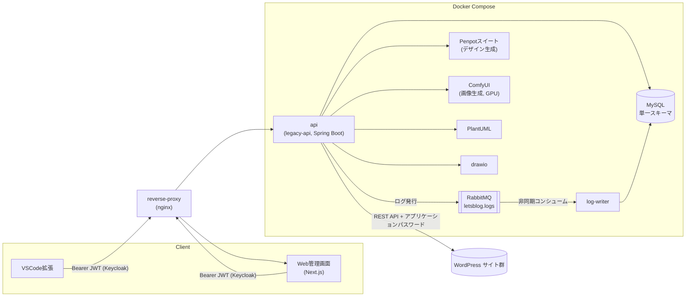
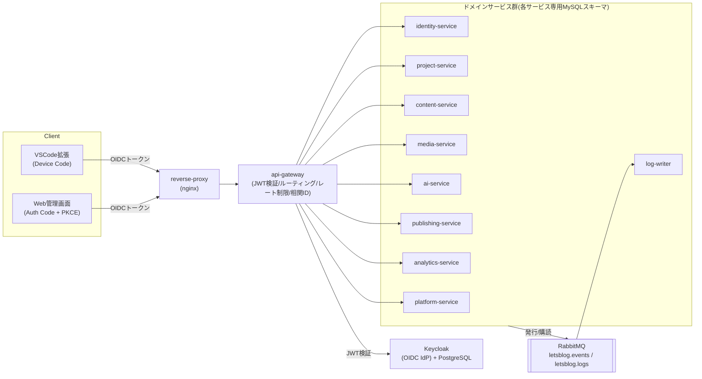

# Let's Blog Server

VSCode上でMarkdownを執筆し、複数のWordPressサイトへ投稿できる自己ホスト型の仲介システム。
AI執筆支援(外部LLMサービス)・チャットでの壁打ちからのプロンプト生成込みのアイキャッチ/挿絵の自動生成(ComfyUI)・
図表レンダリング(PlantUML)を含む一式を
Docker Composeでまとめて起動する。クライアントはVSCode拡張機能(執筆・投稿)とWeb管理画面
(サイト管理・投稿履歴・ユーザー管理等)の2つ。

現在はマイクロサービス化 + Keycloak認証基盤への移行(Epic #551)を進行中で、以下はその現状と目標。
設計上の意思決定は [docs/adr/](docs/adr/README.md) に、コンテナ構成の詳細は
[docs/DOCKER_COMPOSE_ARCHITECTURE.md](docs/DOCKER_COMPOSE_ARCHITECTURE.md) にある。

## アーキテクチャ

### 現状(2026年8月時点)

`api`(`services/legacy-api`)がドメインロジックの大半を担う単一サービスに、認証以外の周辺コンポーネント
(RabbitMQ経由の非同期ログ書き込み・Penpotによるデザイン生成・PlantUML/drawioレンダリング・WordPress
プロビジョニング)が接続する構成。



認証はKeycloak(OIDC)発行のJWTへ一括切り替え済み(issue #566)で、旧来のヘッダベースの
自己申告方式([ADR-0002](docs/adr/0002-keycloak-oidc.md) の Context 参照)は撤去した。
このアーキテクチャ図自体は、ドメイン単位のマイクロサービス分割(Phase 19)がまだ進行中の
時点のものであり、api-gateway/identity-service/Keycloakは実際には既に導入済み
(下記「目標構成」の一部を先取りして稼働している)。

### 目標構成(マイグレーション後)

[ADR-0001](docs/adr/0001-domain-based-microservices.md)〜[ADR-0004](docs/adr/0004-schema-per-service.md) の
決定に基づき、ドメイン単位の完全なマイクロサービス化と Keycloak (OIDC) 認証基盤への一括切り替えを行う。



サービス間の同期呼び出しは Client Credentials Grant で相互認証する(図では省略。
サービス数が多く全組み合わせを描くと見づらいため)。

移行の詳細な意思決定は [docs/adr/](docs/adr/README.md) を参照。実行計画は
GitHub の Epic #551 とその子Issueが一次情報。

## CI/CD & Quality

[](https://github.com/tonoccho/lets_blog_server/actions/workflows/api-services-test.yml)
[](https://github.com/tonoccho/lets_blog_server/actions/workflows/frontend-test.yml)
[](https://github.com/tonoccho/lets_blog_server/actions/workflows/extension-test.yml)

[](https://codecov.io/gh/tonoccho/lets_blog_server)
[](https://codecov.io/gh/tonoccho/lets_blog_server)
[](https://codecov.io/gh/tonoccho/lets_blog_server)
[](https://codecov.io/gh/tonoccho/lets_blog_server)

## 目次

- [アーキテクチャ](#アーキテクチャ)
- [ハードウェア要件](#ハードウェア要件)
- [前提ソフトウェア要件](#前提ソフトウェア要件)
- [前提ソフトウェアのインストール](#前提ソフトウェアのインストール)
- [アプリケーションの起動(Docker)](#アプリケーションの起動docker)
- [VSCode拡張機能の入手とインストール](#vscode拡張機能の入手とインストール)
- [関連ドキュメント](#関連ドキュメント)

## ハードウェア要件

| 項目 | 要件 |
|---|---|
| GPU | **NVIDIA GPU(VRAM 16GB以上)必須**。ComfyUI(画像生成)がGPUを使用するため |
| GPUドライバ | NVIDIA GPUドライバ + NVIDIA Container Toolkit(Dockerコンテナへのパススルー用) |
| メモリ | **16GB以上を推奨**(全19コンテナをアイドル状態で起動した実測値で約10.3GiB。ホストOS分の余裕や、ComfyUIでの画像生成時のスパイクを考慮すると16GB以上が安全。詳細は[docs/DOCKER_COMPOSE_ARCHITECTURE.md](docs/DOCKER_COMPOSE_ARCHITECTURE.md#リソース実測)参照) |
| ディスク | Dockerイメージに加え、ComfyUIのモデルファイルで数GB〜十数GB程度の空き容量が必要 |
| ネットワーク | ホストの80番・443番ポートが空いていること(リバースプロキシが使用) |

CPUのみでも動作するイメージタグ(`COMFYUI_IMAGE`をCPU向けタグに変更)にすれば起動は可能だが、
AI機能(下書き/校正支援・画像生成)が実用的な速度で動作しないため、AI機能を利用する場合は
上記GPU要件を満たすことを前提とする。

## 前提ソフトウェア要件

| ソフトウェア | 用途 |
|---|---|
| Git | リポジトリの取得 |
| Docker Engine + Docker Compose(v2系) | 全サービスのコンテナ起動 |
| NVIDIA Container Toolkit | ComfyUIコンテナへのGPUパススルー |
| openssl | リバースプロキシ用の自己署名TLS証明書生成(Linux/macOSは標準搭載) |
| Visual Studio Code | VSCode拡張機能(執筆・投稿)の利用 |

## 前提ソフトウェアのインストール

### Git

```bash
# Ubuntu/Debian
sudo apt-get update && sudo apt-get install -y git
```

macOS/Windowsの場合は [git-scm.com](https://git-scm.com/downloads) からインストーラーを取得する。

### Docker Engine + Docker Compose

公式手順: https://docs.docker.com/engine/install/

```bash
# Ubuntu/Debianの例(公式インストールスクリプト)
curl -fsSL https://get.docker.com | sh
sudo usermod -aG docker "$USER"   # sudoなしでdockerコマンドを使う場合(再ログインが必要)
```

macOS/WindowsはDocker Desktopをインストールする(Compose v2が同梱される)。

インストール後、以下でバージョンを確認する。

```bash
docker --version
docker compose version   # Compose v2系であることを確認
```

### NVIDIA GPUドライバ + NVIDIA Container Toolkit

GPUドライバが未導入の場合は先にNVIDIA公式のGPUドライバをインストールし、`nvidia-smi`が
動作することを確認する。

NVIDIA Container Toolkitの公式手順: https://docs.nvidia.com/datacenter/cloud-native/container-toolkit/latest/install-guide.html

```bash
# Ubuntu/Debianの例
curl -fsSL https://nvidia.github.io/libnvidia-container/gpgkey | sudo gpg --dearmor -o /usr/share/keyrings/nvidia-container-toolkit-keyring.gpg
curl -s -L https://nvidia.github.io/libnvidia-container/stable/deb/nvidia-container-toolkit.list | \
  sed 's#deb https://#deb [signed-by=/usr/share/keyrings/nvidia-container-toolkit-keyring.gpg] https://#g' | \
  sudo tee /etc/apt/sources.list.d/nvidia-container-toolkit.list
sudo apt-get update
sudo apt-get install -y nvidia-container-toolkit
sudo nvidia-ctk runtime configure --runtime=docker
sudo systemctl restart docker
```

### Visual Studio Code

公式手順: https://code.visualstudio.com/download

```bash
# Ubuntu/Debianの例(snap)
sudo snap install code --classic
```

## アプリケーションの起動(Docker)

```bash
git clone <このリポジトリのURL>
cd lets_blog_server

# 1. 環境変数を設定
cp .env.example .env
vi .env   # パスワード・APIキー・暗号化キー・NEXTAUTH_SECRET等を変更
bash scripts/check-env.sh   # .env が .env.example の全項目を満たしているか確認

# 2. リバースプロキシ用の自己署名証明書を生成
bash scripts/generate-certs.sh

# 3. Docker Composeで全サービスを起動
docker compose up -d

# 4. ブラウザで https://localhost にアクセス(自己署名証明書の警告は例外承認する)
```

初回アクセス時、まだユーザーが1人も存在しない場合は `/setup` にリダイレクトされ、
セルフサインアップで最初のユーザー(管理者権限)を作成できる。

環境変数の各項目の詳細、ComfyUIチェックポイントの配置、
トラブルシューティング等は [docs/setup.md](docs/setup.md) を参照。

## VSCode拡張機能の入手とインストール

VSCode拡張機能(`.vsix`)は事前ビルド済みファイルとしては配布されておらず、起動中のサーバーから
オンデマンドビルドしてダウンロードする。

1. `https://localhost/` にログインし、システム画面(`/system`)を開く
2. 「拡張機能をダウンロード (.vsix)」ボタンをクリックし、`letsblog-vscode-<バージョン>.vsix` を保存する

ダウンロードした `.vsix` をVSCodeにインストールする方法は2通り。

**VSCode UIから**

コマンドパレット(`Ctrl+Shift+P` / macOSは`Cmd+Shift+P`)で
`Extensions: Install from VSIX...` を実行し、ダウンロードしたファイルを選択する。

**コマンドラインから**

```bash
code --install-extension letsblog-vscode-<バージョン>.vsix
```

インストール後、コマンドパレットから `Let's Blog: Login` を実行し、サーバーのアカウント
(メールアドレス・パスワード)でログインするとAPIキーが自動的に設定される。拡張の設定
`letsBlog.serverUrl`(既定値: `https://localhost`)がサーバーのURLと一致していることを確認する。

自己署名証明書を使用しているため、VSCodeを起動するシェルで
`NODE_EXTRA_CA_CERTS=/path/to/certs/localhost.crt` を設定してから起動するか、OS/ブラウザの
証明書ストアに `certs/localhost.crt` を信頼済み証明書として登録する必要がある。詳細は
[docs/setup.md](docs/setup.md) の「VSCode拡張の設定」を参照。

拡張のTLS証明書検証は既定で有効(`letsBlog.allowInsecureTls: false`)。上記の証明書登録が
行えない場合に限り、`letsBlog.allowInsecureTls: true` で検証をスキップできるが、
中間者攻撃を検出できなくなるため信頼できるネットワーク上のローカル環境でのみ使用すること。
拡張の設計は [extension/ARCHITECTURE.md](extension/ARCHITECTURE.md)、API仕様は
[extension/API_REFERENCE.md](extension/API_REFERENCE.md)、セキュリティ仕様は
[extension/SECURITY.md](extension/SECURITY.md)、不具合調査は
[extension/TROUBLESHOOTING.md](extension/TROUBLESHOOTING.md) を参照。

## API ドキュメント

REST APIは以下のエンドポイントで公開しています:

- **Swagger UI (対話的ドキュメント)**: `https://localhost/api/swagger-ui.html`
- **OpenAPI JSON スペック**: `https://localhost/v3/api-docs`

APIの認証にはKeycloakが発行するアクセストークンを`Authorization: Bearer`ヘッダーで使用します(issue #566で旧ヘッダベースのAPIキー認証から移行済み)。

## Code Quality & Coverage Details

我々は継続的に全コンポーネント(API・Frontend・Extension)のコード品質を監視しています:

- **API Tests**: JaCoCo経由でコード品質を測定(Java/Spring Boot)
- **Frontend Tests**: Jest経由でユニットテストカバレッジを測定(TypeScript/React)
- **Extension Build**: TypeScript型チェックとコンパイル検証
- **詳細**: [COVERAGE_TARGETS.md](docs/COVERAGE_TARGETS.md) を参照

## 関連ドキュメント

### ユーザーガイド

- [**Getting Started Guide**](docs/GETTING_STARTED.md) — セットアップの詳細ガイド（スクリーンショット説明付き）
- [**Features and Usage Guide**](docs/FEATURES_AND_USAGE.md) — 主要機能と使用方法
- [**Article Authoring Best Practices**](docs/ARTICLE_AUTHORING_BEST_PRACTICES.md) — 記事作成のベストプラクティス
- [**Video Tutorials Guide**](docs/VIDEO_TUTORIALS_GUIDE.md) — ビデオチュートリアルの構成と活用方法
- [**Comprehensive Troubleshooting Guide**](docs/COMPREHENSIVE_TROUBLESHOOTING.md) — 問題解決ガイド

### 技術ドキュメント

- [docs/setup.md](docs/setup.md) — 環境変数・起動手順・トラブルシューティングの詳細
- [docs/DOCKER_COMPOSE_ARCHITECTURE.md](docs/DOCKER_COMPOSE_ARCHITECTURE.md) — コンテナ構成・ポート割当・起動順序
- [docs/adr/](docs/adr/README.md) — アーキテクチャ意思決定記録 (ADR)
- [docs/SERVICE_SCHEMA_MIGRATION.md](docs/SERVICE_SCHEMA_MIGRATION.md) — サービス別MySQLスキーマ分離とデータ移行ガイド
- [docs/AI_SERVICE_PROVIDER_RESEARCH.md](docs/AI_SERVICE_PROVIDER_RESEARCH.md) — 外部AIサービス移行の調査・比較
- [docs/RELEASE_NOTES.md](docs/RELEASE_NOTES.md) — リリースノート

## ライセンス

このプロジェクトはMITライセンスの下で公開されています。詳細は [LICENSE](LICENSE) ファイルを参照してください。
