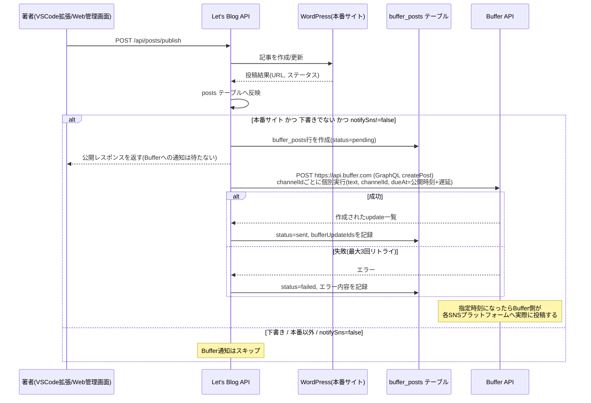

# Buffer連携によるSNS予約投稿(issue #379)

本番サイトへ記事を公開(即時/予約問わず)すると、[Buffer](https://buffer.com/)のAPIを通じて
指定した時間後にSNS(Twitter/Facebook/LinkedIn等)へ自動で投稿予約される。

> Bufferのレガシー REST API(`https://api.bufferapp.com/1/...`)は2027-02-01に廃止予定で、
> 旧来の個人用アクセストークン("Public API token")では既にREST呼び出しが401で拒否されるため、
> GraphQL API(`https://api.buffer.com`)へ移行済み(issue #411)。プロジェクトのアクセストークンは
> Buffer管理画面の「Settings > API」から発行する新しいAPIキーを使う必要がある。

## ワークフロー

## 設計方針

- **遅延はBuffer自身に任せる**: GraphQLの`createPost` mutation呼び出し時に`mode: customScheduled`と
  `dueAt`(公開時刻+設定分、ISO 8601)を指定するだけでよく、当システム側で「5分待ってから投稿する」ための
  独自スケジューラは実装していない。実際にSNSへ投稿されるのはBufferが指定時刻に処理した時点。
- **公開処理をブロックしない**: Buffer呼び出しは`PostPublishService.publish()`から非同期
  (`BufferNotificationService#notifyAsync`, 専用スレッドプール `bufferNotificationExecutor`)で行われる。
  Buffer側の障害・レート制限は記事公開の成否に影響しない。
- **複数SNSプラットフォームへの同時予約**: 設定した複数の`profileIds`(Buffer用語では現在「channel」)へ、
  `createPost` mutationを`channelId`ごとに個別実行してまとめて予約する(GraphQLの`createPost`は
  mutation1回につき単一channelIdしか受け付けないため、REST版の`profile_ids[]`一括指定とは異なる)。
- **リトライ**: Buffer API呼び出しが失敗した場合、最大3回まで一定間隔でリトライする。全て失敗した場合は
  `buffer_posts.status = 'failed'` として記録し、エラー内容を`result_payload`に残す(現時点では自動再送は
  行わない。失敗記録を確認して手動対応する運用を想定)。channelごとの個別呼び出しになったことで、
  一部channelへの投稿が成功した後に別channelへの投稿が失敗してリトライされた場合、成功済みchannelへ
  重複投稿される可能性がある(issue #411で既知の制約として記録)。
- **通知条件**: 下書き(`status=draft`)では通知しない。プロジェクトの本番(live)サイト以外への投稿でも
  通知しない(予約投稿の可否判定と同じ`isProductionSite`判定を再利用)。呼び出し元が
  `notifySns=false` を明示した場合は上記条件を満たしていても通知しない(記事単位での無効化)。

## 設定

有効/無効・アクセストークン・投稿先プロファイルID・投稿までの遅延分数・投稿本文テンプレートは、
**プロジェクトごとに**Web管理画面(プロジェクト詳細画面 > Buffer連携、`/projects/{id}/settings/buffer`)
から設定する(issue #402。以前は環境変数でアプリ全体に1つだけ設定する方式だったが、プロジェクトごとに
異なるBufferアカウント/SNSプロファイルへ投稿できるようプロジェクト単位に変更した)。
アクセストークンは`CredentialCipher`でAES-256-GCM暗号化してprojectsテーブルに保存され、画面には
「設定済みかどうか」のみが表示される。

| 項目 | 説明 | 既定値 |
|---|---|---|
| 有効/無効 | 機能全体の有効/無効。無効の場合、他の設定に関わらず通知しない | 無効 |
| アクセストークン | BufferのAPIキー(Buffer管理画面の「Settings > API」から発行) | (未設定、必須) |
| プロファイルID | 投稿先チャンネル(SNSアカウント、Buffer用語では旧称profile)IDのカンマ区切りリスト。空の場合は通知しない | (未設定、必須) |
| 投稿までの遅延(分) | 公開時刻から実際の投稿までの遅延(分) | `5` |
| メッセージテンプレート | 投稿本文テンプレート。`{title}`/`{url}`が記事タイトル/URLに置換される | `{title} {url}` |

`.env`(`application.yml`経由でAPIコンテナへ渡される、プロジェクト単位ではないAPIエンドポイント自体の設定):

| プロパティ | 環境変数 | 説明 | 既定値 |
|---|---|---|---|
| `app.buffer-api-base-url` | `BUFFER_API_BASE_URL` | Buffer GraphQL APIのエンドポイントURL | `https://api.buffer.com` |
| `app.buffer-request-timeout-seconds` | `BUFFER_REQUEST_TIMEOUT_SECONDS` | Buffer API呼び出しのタイムアウト(秒) | `30` |

## データモデル

`buffer_posts` テーブル(`V49__add_buffer_posts.sql`)が、記事の公開1回につき1行、Bufferへの通知結果を記録する。

| カラム | 説明 |
|---|---|
| `post_id` | `posts.id`への参照 |
| `site_id` | 投稿先サイトID |
| `status` | `pending` → `sent` / `failed` |
| `scheduled_at` | Bufferへ指定した投稿予定時刻(UTC) |
| `request_payload` | Bufferへ送った内容(`profileIds`, `text`)のJSONスナップショット |
| `result_payload` | 成功時は`bufferUpdateIds`(Buffer側の予約ID一覧)、失敗時は`error`メッセージ |

## 既知の制約 / 今後の検討事項

- Buffer失敗時の自動再送(現状は手動対応前提)は実装していない。運用上必要になれば、`buffer_posts`の
  `status=failed`行を対象にした再送バッチ等を別途検討する。
- ダッシュボードの「接続サービス状況」(`ConnectedServiceStatusService`)にBufferの項目は追加していない
  (本Issueの受け入れ基準には含まれないため)。必要であれば別Issueで追加する。
- GraphQL APIの投稿統計(`post.metrics`)は公式ドキュメントに具体的なメトリック種別名が網羅的に
  明記されていないため、`reactions`/`reposts`/`comments`等の代表的な名称にベストエフォートで
  マッピングしている(`BufferClient#getUpdateStatistics`)。実際の値と齟齬がある場合は要調整(issue #411)。
