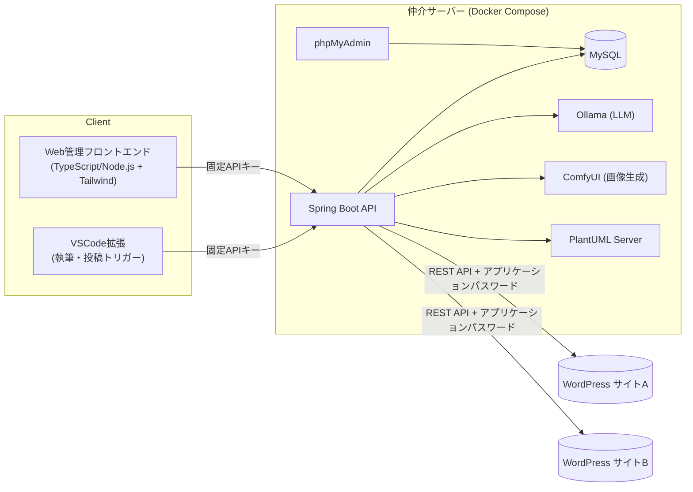

# Phase 1: 全体概要

## 目的

VSCode上でMarkdownを執筆し、複数のWordPressサイトへ投稿できる自己ホスト型の仲介システムを構築する。
初期構築(Phase 1)では、将来的なCMS/エディタの差し替えを見据えたアーキテクチャで、AI執筆支援(Ollama)・画像生成(ComfyUI)・図表レンダリング(PlantUML)を含む一式を最初から立ち上げる。

## アーキテクチャ

## 決定済み事項

| 項目 | 決定内容 |
|---|---|
| 投稿トリガー | VSCode拡張(執筆・投稿) / Webフロントは管理画面用途 |
| 同期方向 | 一方向(Markdown → WordPress) |
| 画像 | 本文中ローカル画像を投稿時に自動アップロード |
| WP認証 | REST API + アプリケーションパスワード |
| WPホスティング | 自己ホスト(wp-json有効)、複数サイト切り替え対応 |
| カテゴリ/タグ | Front matterに名前で指定、存在しなければ自動作成 |
| 仲介サーバー実行基盤 | ローカル実行(localhost)、Docker Composeで一式管理 |
| サーバー実装 | API: Spring Boot(Java) / フロント: TypeScript・Node.js + Tailwind |
| データ store | MySQL(+ phpMyAdminで管理) |
| クライアント↔サーバー認証 | 固定APIキー |
| Ollama用途 | 記事の下書き・校正・要約支援、タグ/カテゴリ自動提案 |
| ComfyUI用途 | アイキャッチ・本文挿入画像の自動生成 |
| PlantUML用途 | Markdown内の図ブロックを自動レンダリング |

## Phase 1 のスコープ

- 上記アーキテクチャ図に含まれる全コンポーネントの初期構築
- WordPress以外のCMS対応は行わない(将来のアダプタ追加を阻害しない設計にとどめる)
- リモート公開・複数人利用は対象外(ローカル環境・個人利用が前提)

## タスク一覧

1. [01-docker-compose](01-docker-compose.md)
2. [02-database-schema](02-database-schema.md)
3. [03-api-server](03-api-server.md)
4. [04-vscode-extension](04-vscode-extension.md)
5. [05-web-frontend](05-web-frontend.md)
6. [06-ollama-integration](06-ollama-integration.md)
7. [07-comfyui-integration](07-comfyui-integration.md)
8. [08-plantuml-integration](08-plantuml-integration.md)

## 未決事項(壁打ちで継続検討)

- Markdown Front matter の詳細スキーマ
- 投稿パイプラインの詳細な処理順序
- Web管理フロントエンドの詳細機能範囲
- ComfyUI/PlantUMLの呼び出しをMarkdown内でどう記述するか(記法設計)
