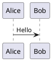

# 08. PlantUML 連携

## 目的

Markdown内に記述された図ブロックをPlantUMLサーバーでレンダリングし、投稿時に画像として埋め込む。

## 前提・決定事項

- 実行基盤: Docker Compose上の `plantuml` サービス(`plantuml/plantuml-server:jetty`、[01-docker-compose](01-docker-compose.md))
- 用途: Markdown内の図ブロックの自動レンダリング

## 想定記法

標準的なFenced code blockを利用する想定。

````markdown

````

## 実装状況(更新: 08-plantuml-integration 完了時点)

- 出力形式は **PNG** に決定(WordPress側のSVGアップロード許可設定が環境依存で不安定なため、追加設定なしで確実に表示できるPNGを採用)。
- `api/src/main/java/com/letsblog/api/render/PlantUmlEncoder.java`: PlantUMLサーバーのURL(`/png/<encoded>`)が要求する独自エンコード(raw deflate + 64文字専用アルファベット)をJavaで実装(外部ライブラリ不使用)。
- `render/PlantUmlClient.java`: 上記エンコードを用いて `GET /png/<encoded>` を呼び出しPNGバイト列を取得。
- `service/PlantUmlEmbedService.java`: Markdown本文中の ```` ```plantuml ```` フェンスコードブロックを正規表現で検出し、各ブロックをレンダリング→`CmsAdapter.uploadMedia`でWordPressへアップロード→ブロック全体を `` に置換する。`PostPublishService.publish()` の先頭(画像アップロード処理より前)に組み込み済み。
- `POST /api/render/plantuml` — `{ source }` → PNGバイナリ(`Content-Type: image/png`)を返す単体レンダリングエンドポイントも実装(動作確認・将来のプレビュー用途)。

**実機検証**: 独自エンコードの正しさを単体(`/api/render/plantuml`でシーケンス図をレンダリングし目視確認)で検証した上で、日本語を含むPlantUMLブロックを含むMarkdownを実際に投稿し、`plantuml-1.png`としてWordPressメディアライブラリへアップロードされ、記事本文中に正しく画像として埋め込まれることを確認済み。

## タスクチェックリスト

- [x] Markdown内 ```plantuml ブロックの記法を最終確定(標準的なFenced code block、`@startuml`/`@enduml`省略時は自動補完)
- [x] APIサーバー側 `/api/render/plantuml` エンドポイント実装(PlantUMLサーバーへのプロキシ)
- [x] レンダリング結果(PNG)をWordPress Media APIへアップロードし、本文中に画像として差し替える処理を実装
- [ ] キャッシュ戦略の検討(同一図の再レンダリングを避ける)— 未実装、Phase2以降で検討

## 未決事項

- 出力形式はPNGに確定したため解消。ただしSVGを選びたいユースケース(高解像度ディスプレイでの表示品質)が出てきた場合はWordPress側の許可MIMEタイプ設定と合わせて再検討。
- 図の差分検知(本文が変わらなければ再レンダリング・再アップロードをスキップする仕組み)は未実装。毎回の投稿で全PlantUMLブロックが再アップロードされるため、頻繁な再投稿を行う記事では画像がメディアライブラリに増え続ける点に注意。
