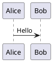

# 08. PlantUML 連携

## 目的

Markdown内に記述された図ブロックをPlantUMLサーバーでレンダリングし、投稿時に画像として埋め込む。

## 前提・決定事項

- 実行基盤: Docker Compose上の `plantuml` サービス(`plantuml/plantuml-server:jetty`、[01-docker-compose](01-docker-compose.md))
- 用途: Markdown内の図ブロックの自動レンダリング

## 想定記法

標準的なFenced code blockを利用する想定。

````markdown

````

## タスクチェックリスト

- [ ] Markdown内 ```plantuml ブロックの記法を最終確定
- [ ] APIサーバー側 `/api/render/plantuml` エンドポイント実装(PlantUMLサーバーへのプロキシ)
- [ ] レンダリング結果(PNG/SVG)をWordPress Media APIへアップロードし、本文中に画像として差し替える処理を実装
- [ ] キャッシュ戦略の検討(同一図の再レンダリングを避ける)

## 未決事項

- 出力形式(PNG or SVG)。SVGの方が高品質だがWordPress側のSVG対応(セキュリティ設定)に注意が必要
- 図の差分検知(本文が変わらなければ再レンダリング・再アップロードをスキップする仕組みの要否)
