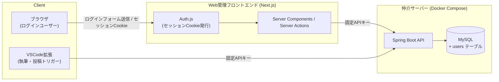

# Phase 2: 全体概要

## 目的

Web管理フロントエンドを複数人で利用できるように、ログイン機能(ユーザー認証)を追加する。
Phase 1では個人利用前提でログイン機能を省略し、固定APIキー(`SERVER_API_KEY`)のみでWeb管理フロントエンド↔APIサーバー間の通信を保護していた([phase1/05-web-frontend](../phase1/05-web-frontend.md)の未決事項)。今回はその上に「Web管理画面を操作している人間が誰か」を識別するための認証層を追加する。

## アーキテクチャ(更新)

- ブラウザは引き続きAPIサーバーに直接アクセスしない(Phase 1の方針を維持)。固定APIキーもブラウザに露出しない。
- 「複数人利用」のためのログインは、ブラウザ⇔Next.jsサーバー間のセッションCookie(Auth.js)で実現する。
- ユーザーアカウント(email/パスワードハッシュ/role)はAPIサーバー側のMySQL(`users`テーブル)で管理し、Next.jsサーバーがAPIサーバー経由で照合・CRUDを行う。

## 決定済み事項

| 項目 | 決定内容 |
|---|---|
| セッション方式 | Auth.js(NextAuth)、Credentials Provider |
| ユーザーストア | APIサーバー側MySQLに`users`テーブルを新設(Next.js側にはDBを持たない) |
| パスワード照合 | APIサーバー側で実施(`POST /api/auth/login`)。ハッシュはBCrypt |
| ユーザー管理方法 | 管理UI/APIを実装する(admin roleのユーザーがWeb画面から追加・削除・role変更を行う) |
| 権限モデル | `admin` / `user` の2ロール。ユーザー管理機能はadminのみアクセス可 |
| APIサーバーとの通信 | 既存の固定APIキー方式は変更しない。ユーザー管理系エンドポイントも`ApiKeyAuthFilter`配下に置く |

## Phase 2 のスコープ

- Web管理フロントエンドのログイン機能・セッション管理
- ユーザー管理(追加・一覧・削除・role変更)のAPI・UI
- 既存画面(`/`, `/sites`, `/posts`, `/ai-jobs`, `/system`)のログイン必須化

対象外(`spec/todo.md`の「Phase 2以降」バックログに残す):
- WordPress以外のCMSアダプタ追加
- リモート常時稼働化・外部公開時のセキュリティ強化

## タスク一覧

1. [01-database-schema](01-database-schema.md)
2. [02-api-server](02-api-server.md)
3. [03-web-frontend](03-web-frontend.md)

## 未決事項(壁打ちで継続検討)

- 初回管理者アカウントの投入方法(環境変数からのブートストラップを想定、[01-database-schema](01-database-schema.md)参照。要レビュー)
- パスワードリセット機能の要否(Phase 2では対象外の想定。必要になれば別途対応)
- 監査ログ(誰がいつ何をしたか)の要否(Phase 2では対象外)
